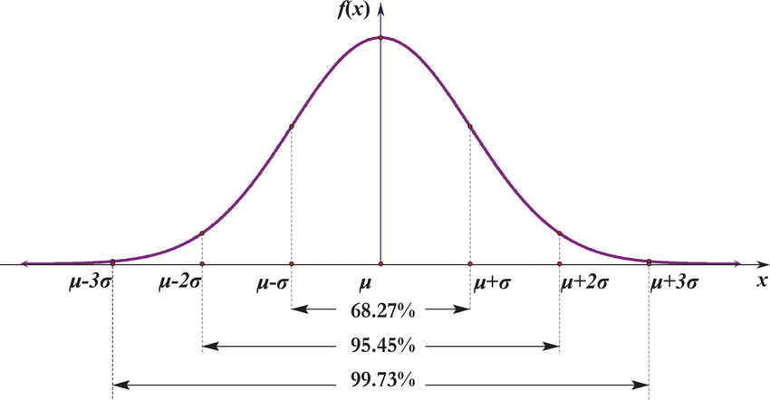

### Probability density function (PDF)

Recall that the cumulative distribution function (CDF) of an r.v. $X$ is the function $F$ given by $F(x) = P(X \leq x).$

.definition-box[
An random variable has a **continuous distribution** if its cumulative distribution function (CDF) is differentiable. We also allow there to be endpoints (or finitely many points) where the CDF is continuous but not differentiable, as long as the CDF is differentiable everywhere else.      
A **continuous r.v.** is a random variable with a continuous distribution.
]

--

Instead of a PMF, in this case we have a PDF:

.definition-box[
For a continuous r.v. $X$ with CDF $F$, the **probability density function (PDF)** of $X$ is the derivative $f$ of the CDF, given by 
$$f(x) = F'(x).$$
The support of $X$, and of its distribution, is the set of all $x$ where $f(x) > 0$.
]

---

### CDF and PDF

The PDF is analogous to the PMF in many ways, but there is a key difference: for a PDF $f$, the quantity $f(x)$ is not a probability, and in fact it is possible to have $f(x) > 1$ for some values of $x$. To obtain a probability, we need to integrate the PDF. The fundamental theorem of calculus tells us how to get from the PDF back to the CDF.

--

.theorem-box[
**PDF to CDF**. Let $X$ be a continuous r.v. with PDF $f$. Then the CDF of $X$ is given by:
$$F(x) = \int_{-\infty}^{x} f(t)dt.$$
]

The above result is analogous to how we obtained the value of a discrete CDF at $x$ by summing the PMF over all values less than or equal to $x$; here we integrate the PDF over all values up to $x$, so the CDF is the *accumulated area* under the PDF.

---

### PDF, CDF and probabilities

We can freely convert between the PDF and the CDF using the inverse operations of integration and differentiation. That means both the PDF and CDF carry complete information about the distribution of a continuous r.v.

--

For a continuous r.v. $X$, the probability of any single value is zero; i.e. for any $x\in \mathbb{R}$ we have $P (X = x) = 0$. For example if you model a waiting time by a random variable $X$, then the probability of waiting 5,123123123123... or exactly 5.0 minutes will be zero!


That means, we can include or exclude the endpoints as we wish without altering the probability, since the endpoints have probability 0:

** $P(a <X < b) = P(a < X \leq b)= P(a \leq X < b)= P(a \leq X \leq b)$ **

To get a desired probability, integrate the PDF over the appropriate range:

** $P(a <X \leq b) = F(b) - F(a) = \int_{a}^b f(x)dx.$ **


---

### PDF properties

.theorem-box[
Valid PDFs. The PDF $f$ of a continuous r.v. must satisfy the following two criteria:
* Nonnegative: $f(x) \geq 0$
* Integrates to 1: $\int_{-\infty}^{\infty} f(x)dx=1$
]

--

**Example.** Let $X$ be a continuous random variable with the following PDF
\begin{equation}
\nonumber f_X(x) = \left\{
\begin{array}{l l}
ce^{-x} & \quad x \geq 0\\
0 & \quad \text{otherwise}
\end{array} \right.
\end{equation}
where $c$ is a positive constant.

(a) Find $c$

(b) Find the CDF of X, $F_X(x)$

(c) Find $P(1 < X < 3)$

---

**Solution.** **(a)** To find $c$, we can use Property 2 above, in particular
$$1=\int_{-\infty}^{\infty} f_X(x)dx= \int_{0}^{\infty} ce^{-x}dx = c \bigg[-e^{-x}\bigg]_{0}^{\infty}=
c\big(-\lim_{x\rightarrow \infty} e^{-x} + e^0\big) =c$$
$$\Rightarrow c=1$$
--

**(b)** To find the CDF of X, we use $F_X(x)=\int_{-\infty}^{x} f_X(t)dt$, so for $x < 0$, we
obtain $F_X(x)=0$. For $x \geq 0$, we have
$$F_X(x) = \int_{0}^{x} e^{-t}dt=1-e^{-x} \Rightarrow
F_X(x) = \left\{\begin{array}{l l}1-e^{-x} & \quad x\geq 0\\0 & \quad \text{otherwise}\end{array} \right.$$

--

**(c)** We can find $P(1 < X < 3)$ using either the CDF or the PDF. If we use the CDF,
we have
$$P(1 < X < 3)=F_X(3)-F_X(1)=\big(1-e^{-3}\big)-\big(1-e^{-1}\big)=e^{-1}-e^{-3}.$$
Equivalently, we can use the PDF. We have

$$P(1 < X < 3)=\int_{1}^{3} f_X(t)dt=\int_{1}^{3} e^{-t}dt=e^{-1}-e^{-3} \approx 0.3181.$$

---

We can use R to make a plot of the PDF $f$ and CDF $F$ from the previous example:

```{r, fig.show="hold", fig.height=8, fig.width=10, out.width="50%" }
x  <- seq(0,10,0.01)
fx <- exp(-x) # this calculates the PDF
plot(x, fx, ylim=c(0,1), type="l", main = "Probability density function", 
     xlab="x", ylab="f(x)")
abline(v=c(1,3), col="red")

Fx <- 1-exp(-x) # this calculates the CDF
plot(x, Fx, type="s", main = "CDF", xlab="x", ylab="F(x)", ylim=c(0,1))
abline(v=c(1,3), col="red")
```

---

### Expectation of a continuous r.v.

.definition-box[
The expected value (also called expectation or mean) of a continuous r.v. $X$ with PDF $f$ is:
$$E(X) = \int_{-\infty}^{\infty}xf(x)dx.$$
]

--

* The integral is taken over the entire real line, but if the support of $X$ is not the entire real line we can just integrate over the support. 
* Note that this expectation may or may not exist.
* LOTUS holds for continuous r.v.s replacing the sum for an integral.

.theorem-box[
LOTUS, continuous. If $X$ is a continuous r.v. with PDF $f$ and $g$ is a function from $\mathbb{R}$ to $\mathbb{R}$, then:
$$E(g(X)) = \int_{-\infty}^{\infty}g(x)f(x)dx.$$
]

---

### Uniform Distribution $U \sim Unif(a,b)$

.definition-box[
A continuous r.v. $U$ is said to have the **Uniform distribution** on the interval $(a,b)$ if its PDF is:

\begin{equation}
f_X(x) = \left\{
\begin{array}{l l}
\frac{1}{b-a} & \quad a < x < b\\
0 & \quad x < a \textrm{ or } x > b
\end{array} \right.
\end{equation}
]

--

.pull-left[
The Uniform distribution that we will most frequently use is the $\operatorname{Unif}(0, 1)$ distribution, also called the **standard Uniform**.

The $\operatorname{Unif}(0, 1)$ PDF and CDF are particularly simple: $f(x) = 1$ and $F(x) = x$ for $0 < x < 1$.
]

.pull-right[
```{r echo=FALSE, out.width="100%", fig.height=4, fig.width=6}
# Load necessary library
library(ggplot2)

# Define the sequence of x values
x <- seq(0, 1, length.out = 100)

# Calculate the PDF and CDF
pdf_values <- dunif(x, min = 0, max = 1)
cdf_values <- punif(x, min = 0, max = 1)

# Create a data frame
data <- data.frame(x = x, PDF = pdf_values, CDF = cdf_values)

# Plot the PDF
pdf_plot <- ggplot(data, aes(x = x, y = PDF)) +
  geom_line(color = "blue", linewidth = 1) +
  labs(title = "PDF of Unif(0, 1)", x = "x", y = "f(x)")

# Plot the CDF
cdf_plot <- ggplot(data, aes(x = x, y = CDF)) +
  geom_line(color = "red", linewidth = 1) +
  labs(title = "CDF of Unif(0, 1)", x = "x", y = "F(x)")

# Display the plots
library(gridExtra)
grid.arrange(pdf_plot, cdf_plot, ncol = 2)
```
]

---

### Expectation and Variance - Uniform Distribution

**Expectation:**

$E(U) = \int_{a}^{b}x\cdot \frac{1}{b-a}dx=\frac{1}{b-a}\cdot\frac{x^2}{2} \bigg|_a^b = \frac{b^2-a^2}{2(b-a)}=\frac{(b-a)(b+a)}{2(b-a)}=\frac{b+a}{2}$

--

**Variance:**

$E(U^2) = \int_{a}^{b}x^2\cdot \frac{1}{b-a}dx= \frac{1}{b-a}\cdot \frac{x^3}{3} \bigg|_a^b = \frac{b^3-a^3}{3(b-a)}=\frac{(b-a)(a^2 + b^2 + ab)}{3(b-a)}=\frac{a^2 + b^2 + ab}{3}$

--

$$\text{Then } Var(U) = E(U^2) - [E(U)]^2= \frac{a^2 + b^2 + ab}{3} - \left[\frac{a+b}{2}\right]^2$$
$$=\frac{a^2 + b^2 + ab}{3} -\frac{a^2+2ab+b^2}{4} =\frac{a^2-2ab+b^2}{12}= \frac{(b-a)^2}{12}$$
---

### Standard Normal distribution $Z \sim N(0,1)$

.definition-box[
A continuous r.v. $Z$ is said to have the **standard Normal distribution** if its PDF $\varphi$ is given by: $$\varphi(z) = \frac{1}{\sqrt{2 \pi}}e^{-z^2/2}, \text{ for } -\infty < z < \infty.$$
]

* We write this as $Z \sim N(0,1)$ since, as we will show, $E(Z) =0$ and $Var(Z)=1$.
* Normalizing constant: $\frac{1}{\sqrt{2 \pi}}$ it makes the PDF to integrate to 1.

--

* **Standard Normal CDF $\Phi$** is the accumulated area under the PDF:

** $$\Phi(z)=\int_{-\infty}^{z} \varphi(t)dt = \int_{-\infty}^{z}\frac{1}{\sqrt{2 \pi}}e^{-t^2/2}dt.$$ **

* It's mathematically impossible to find a closed-form expression for the antiderivative of $\varphi$, this means we cannot express $\Phi$ as a finite sum of more familiar functions.

---

Let's show that ** $\varphi$ is a valid PDF.** We know $\varphi$ is nonnegative, we only need to show that the area under $e^{-z^2/2}$ is $\sqrt{2 \pi}$. We will use the trick of writing the integral twice to save us some trouble with the antiderivative of $e^{-z^2/2}$.

--

$$
\begin{aligned}
\left(\int_{-\infty}^{\infty} e^{-z^2 / 2} d z\right)\left(\int_{-\infty}^{\infty} e^{-z^2 / 2} d z\right) & =\left(\int_{-\infty}^{\infty} e^{-x^2 / 2} d x\right)\left(\int_{-\infty}^{\infty} e^{-y^2 / 2} d y\right) \\
& =\int_{-\infty}^{\infty} \int_{-\infty}^{\infty} e^{-\frac{x^2+y^2}{2}} d x d y \\
& =\int_0^{2 \pi} \int_0^{\infty} e^{-r^2 / 2} r d r d \theta
\end{aligned}
$$
--

In the final step we switched to polar coordinates. Recall that for polar coordinates we have $x^2+y^2=r^2$ and $dxdy=rdrd\theta$.    

--

We can now use the substitution $u=r^2 / 2, d u=r d r$. This gives
$$
\begin{aligned}
\int_0^{2 \pi} \int_0^{\infty} e^{-r^2 / 2} r d r d \theta & =\int_0^{2 \pi}\left(\int_0^{\infty} e^{-u} d u\right) d \theta =\int_0^{2 \pi} 1 d \theta=2 \pi
\end{aligned}
$$
$$\Rightarrow \int_{-\infty}^{\infty} e^{-z^2 / 2} d z=\sqrt{2 \pi}$$
---

### Standard Normal distribution properties


```{r echo=FALSE, fig.show="hold", out.width="50%", fig.height=4, fig.width=6}
x <- seq(-4, 4, length=100)
plot(x, dnorm(x), type="l", lty=2, xlab="z",
  ylab="f(z)", main="PDF: Standard Normal Distribution")
plot(x, pnorm(x), type="l", lty=2, xlab="z",
  ylab="F(z)", main="CDF: Standard Normal Distribution")
```


* **Symmetry of PDF:** $\varphi$ satisfies ** $\varphi(z) = \varphi(-z)$ **, i.e., $\varphi$ is an even function.

--

* **Symmetry of tail areas:** For all $z$, ** $\Phi(z)= 1-\Phi(-z).$ **
For example, the area under the PDF curve to the left of $-2$, which is $P(Z \leq -2 )= \Phi(-2)$ by definition, equals to area to the right of 2, which is $P(Z \geq 2 )= 1- P(Z < 2) = 1-\Phi(2).$ 

--

* **Symmetry of $Z$ and $-Z$:** If $Z\sim N(0,1),$ then $-Z\sim N(0,1)$ as well:
$$P(-Z \leq z) = P(Z\geq -z) = 1 - P(Z < -z) = 1 - \Phi(-z) = \Phi (z).$$

---

### Normal distribution properties (cont.)

* ** $E(Z) = 0$. ** $E(Z) = \frac{1}{\sqrt{2 \pi}}\int_{-\infty}^{\infty}z e^{-z^2/2}dz.$

$g(z)= ze^{-z^2/2}$ is an odd function, the area under $g(z)$ in the negative side cancels the area under g from the positive side. Therefore $E(Z) = 0.$ You can use the same argument for $E(Z^n) = 0$ for any **odd positive integer n**.

--

* ** $Var(Z) = 1$. ** $Var(Z) = E(Z^2) - \left(E(Z)\right)^2 = E(Z^2)$
$$= \frac{1}{\sqrt{2 \pi}}\int_{-\infty}^{\infty}z^2 e^{-z^2/2}dz = \frac{2}{\sqrt{2 \pi}}\int_{0}^{\infty}z^2 e^{-z^2/2}dz,$$ since $z^2 e^{-z^2/2}$ is an even function.

--

Use integration by parts: $u=z$, $dv=ze^{-z^2/2}$, $du=dz$, and $v=-e^{-z^2/2}:$

$$Var(Z) = \frac{2}{\sqrt{2 \pi}} \left( -ze^{-z^2/2} \bigg|_{0}^{\infty} + \int_{0}^{\infty}e^{-z^2/2}dz \right) =\frac{2}{\sqrt{2 \pi}} \left( 0 + \frac{\sqrt{2 \pi}}{2} \right) =1$$

---

### Normal distribution  $Z \sim N(\mu, \sigma^2)$

But not all normals are centered in 0 and have variance 1.

.definition-box[
If $Z \sim N(0,1),$ then: ** $X = \mu + \sigma Z$ **
is said to have the **Normal Distribution** with mean $\mu$ and variance $\sigma^2$, for any real $\mu$ and $\sigma^2$ with $\sigma>0.$     
We denote this by $Z \sim N(\mu, \sigma^2).$
]

--

Properties: ** $E(\mu+ \sigma Z) = \mu$ ** and ** $Var(\mu+ \sigma Z) = \sigma^2 Var(Z) = \sigma^2.$ **

```{r echo=FALSE, fig.show="hold", out.width="50%", fig.height=4, fig.width=6}
x <- seq(-50, 50, length=100)
plot(x, dnorm(x, 10,10), type="l", lty=2, xlab="z",ylim=c(0,0.4),
  ylab="f(z)", main="PDF: Standard Normal Distribution")
lines(x, dnorm(x,1,5), type="l", lty=1)
lines(x, dnorm(x,5,1), type="l", lty=3)
plot(x, pnorm(x, 10, 10), type="l", lty=2, xlab="z",ylim=c(0,1),
  ylab="F(z)", main="CDF: Standard Normal Distribution")
lines(x, pnorm(x, 1,5), type="l", lty=1)
lines(x, pnorm(x, 5,1), type="l", lty=3)
```

---

### Standardization

Standardization: the process of getting a standard Normal from a non-standard Normal. For $X \sim N(\mu,\sigma^2).$, the standardized version of $X$ is ** $$\frac{X − \mu}{\sigma} \sim N (0, 1).$$ **

--

We can use standardization to find the CDF and PDF of $X$ in terms of the standard
Normal CDF and PDF:

.theorem-box[
**Normal CDF and PDF.** Let $X \sim N(\mu,\sigma^2).$ Then the CDF of $X$ is:
$$F(x) = \Phi\left(\frac{x-\mu}{\sigma} \right)$$
and the PDF of $X$ is 
$$f(x) = \varphi\left(\frac{x-\mu}{\sigma} \right) \frac{1}{\sigma}$$
]

---

**Proof.** 

For the CDF, we start from the definition $F(x)=P(X \leq x)$, standardize, and use the CDF of the standard Normal:
$$
F(x)=P(X \leq x)=P\left(\frac{X-\mu}{\sigma} \leq \frac{x-\mu}{\sigma}\right)=\Phi\left(\frac{x-\mu}{\sigma}\right).
$$
--

Then we differentiate to get the PDF, applying the chain rule from Calculus:
$$
\begin{aligned}
f(x) & =\frac{d}{d x} \Phi\left(\frac{x-\mu}{\sigma}\right)=\varphi\left(\frac{x-\mu}{\sigma}\right) \frac{1}{\sigma}.
\end{aligned}
$$
<br>

Let $X \sim N(\mu,\sigma^2).$ We can also write out its PDF as
.definition-box[
$$
f(x)=\frac{1}{\sqrt{2 \pi} \sigma} \exp \left(-\frac{(x-\mu)^2}{2 \sigma^2}\right)
$$
]

---

### 68-95-99.7% rule


.theorem-box[
If $X \sim N(\mu,\sigma^2),$ then:
$$P(|X- \mu|< \sigma) \approx 0.68$$
$$P(|X- \mu|< 2\sigma) \approx 0.95$$
$$P(|X- \mu|< 3\sigma) \approx 0.997$$
]

<center>

</center>


If $X \sim N(0,1),$ then:

$P(|X|< 1) \approx 0.68$, $P(|X|< 2) \approx 0.95$ and $P(|X|< 3) \approx 0.997$.

---

**Example.** Let $X \sim N(-1,4)$. What is $P(|X|<3)$? Write it first in terms of $\Phi$ and then find it approximately.

$$P(-3 < X < 3) = P\left(\frac{-3-(-1)}{2}<\frac{X-(-1)}{2}<\frac{3-(-1)}{2}\right)$$

$$\Rightarrow P(-3 < X < 3) = P\left(-1 < Z < 2\right) = \Phi(2) - \Phi(-1).$$
--

Approximately: $P(-1 < Z <1)= 0.68$, then:

$$P\left(-1 < Z < 2\right) = P(-1 < Z < 1) + P(1 < Z <2)$$
$$= P(-1 < Z < 1) + \frac{P(-2< Z <2) - P(-1< Z <1)}{2}$$
$$\approx 0.68 + \frac{(0.95-0.68)}{2} = 0.815.$$
--

Another approximation using R:

```{r}
pnorm(2) - pnorm(-1)
```

(so we don't have to use statistical tables)

---

### Exponential Distribution $X \sim \operatorname{Expo}(\lambda)$

Recall that a Geometric random variable counts the number of failures before the first success in a sequence of Bernoulli trials. The story of the Exponential distribution is analogous, but we are now waiting for a success in *continuous* time, where successes arrive at a rate of $\lambda$ successes per unit of time.

An exponential r.v. represents **the waiting time until the first arrival of a success**. The parameter ** $\lambda$ ** in this case can be interpreted as the **rate of successes (or arrivals) per unit of time**.

--

.definition-box[
A continuous r.v. $X$ is said to have the **Exponential distribution** with parameter $\lambda$, where $\lambda >0$ if its PDF is: $$f(x) = \lambda e^{-\lambda x},$$
for $x > 0$. The corresponding CDF is: $$F(x) = 1 - e^{-\lambda x}$$
]

---

### $\operatorname{Expo}(\lambda)$ and $\operatorname{Expo}(1)$

We’ve seen how all Uniform and Normal distributions are related to one another via location-scale transformations, and we might wonder whether the Exponential distribution allows this too. 

* Support $(0, \infty)$, so we shouldn't move the center to the left of 0.
* But scale transformations work nicely, and we can use scaling to get from the simple $\operatorname{Expo}(1)$ to the general $\operatorname{Expo}(\lambda)$: 

--

** $$\text{If } X \sim \operatorname{Expo}(1), \text{ then }  \frac{X}{\lambda}\sim \operatorname{Expo}(\lambda).$$ **

Let $Y=\frac{X}{\lambda}$. Then
$$P(Y \leq y) = P \left( \frac{X}{\lambda} \leq y \right) = P(X \leq \lambda y) = 1 - e^{-\lambda y}.$$
Conversely, **if $Y \sim \operatorname{Expo}(\lambda),$ then $\lambda Y \sim \operatorname{Expo}(1).$ **

---

### Mean and variance of $\operatorname{Expo}(1)$ and $\operatorname{Expo}(\lambda)$

If $X \sim \operatorname{Expo}(1)$, then both $E(X)$ and $Var(X)$ are obtained using standard integration by parts calculations:

$$E(X) = \int_{0}^{\infty}xe^{-x}dx=1$$
$$E(X^2) = \int_{0}^{\infty}x^2e^{-x}dx=2$$
$$\text{Then } Var(X) = E(X^2) - (E(X))^2 =1.$$
--

Coming back to the scale transformation: $Y = \frac{X}{\lambda}$, where $X \sim Expo(1)$, we can obtain the mean and variance of the $\operatorname{Expo}(\lambda)$ distribution:

$$E(Y)=E\left(\frac{X}{\lambda}\right)=\frac{1}{\lambda}E(X)= \frac{1}{\lambda}$$
$$Var(Y)=Var\left(\frac{X}{\lambda}\right)=\left(\frac{1}{\lambda}\right)^2Var(X)= \frac{1}{\lambda^2}.$$
---

### Memoryless property

The Exponential distribution has a very special property called the memoryless property, which says that even if you’ve waited for hours or days without success, the success isn’t any more likely to arrive soon.

.definition-box[
A continuous distribution is said to have the **memoryless property** if a r.v. $X$ from that distribution satisfies:
$$P(X \geq s + t | X \geq s) = P(X \geq t)$$
for all $s,t \geq 0.$
]

"After you have waited $s$ minutes, the probability you will have to wait another $t$ minutes is exactly the same as the probability of having to wait $t$ minutes with no previous waiting time under your belt".

---

### Exponential distribution has the memoryless property

* Conditional on $X \geq s$, the additional waiting time $X-s$ is still distributed $Expo(\lambda)$. We can verify this using the definition of conditional probability:

$$P(X \geq s + t | X \geq s) = \frac{P(X \geq s+t)}{P(X \geq s)}= \frac{e^{-\lambda(s+t)}}{e^{-\lambda s}}= e^{- \lambda s} = P(X \geq t)$$
--

* Memoryless property, in practice, means that we assume that there is no "wear-and-tear" effect, since no matter how long the machine has been functional, conditional on having lived that long, the machine is good as new.

* Some useful applications: radioactive decay, time until the next call, among others.

* Exponential is the only continuous distribution ** on $(0, \infty)$ ** that is memoryless. Geometric distribution is also memoryless.

---

### The Geometric distribution is memoryless

It turns out The Geometric distribution is essentially the only discrete memoryless distribution!

This follows from the story of the Geometric: consider Bernoulli trials, waiting for the first success (and defining waiting time to be the number of failures before the first success). 

--

Say we have already had $j$ failures without a success. Then the additional waiting time from that point forward has the same distribution as the original waiting time (the Bernoulli trials neither are conspiring against the experimenter nor act as if the experimenter is due for a success: the trials are independent). 

--

A calculation agrees: for $X \sim \operatorname{Geom}(p)$,
$$
P(X \geq j+k \mid X \geq j)=\frac{P(X \geq j+k)}{P(X \geq j)}=\frac{q^{j+k}}{q^j}=q^k=P(X \geq k) .
$$
---
### Poisson Process

* The use of $\lambda$ as a parameter in the Exponential distribution and in the Poisson distribution is no coincidence.

* Exponential and Poisson distributions are **connected** by a common story: the story of **Poisson processes**.

* Story: sequence of arrivals occurring at different points on a timeline, such that the number of arrivals in a particular interval of time has a Poisson distribution. 

--

.definition-box[A process of arrivals in continuous time is called a **Poisson process** with rate $\lambda$ if the following two conditions hold:
1. The number of arrivals that occur in an interval of length $t$ is a $Pois(\lambda t)$ random variable
2. The numbers of arrivals that occur in disjoint intervals are independent of each other. 
]

.footnote[
We will concentrate on PP in $(0,\infty)$ for now, but one can define PP on other intervals, and in more than one dimension.
]

---

**Example ( Poisson process)** Arrivals of emails landing in an inbox according to a Poisson process with rate $\lambda$. 

* One question you could ask is: in one hour, how many emails will arrive? in this case you can use a Poisson discrete distribution (we are dealing with counts).

* Another question is: how long does it take until the first email arrives? waiting time is a positive number, and its continuous. Let $T_1$ be the time until the first email arrives. 

--

$T_1 > t$ is the same event as $N_t =0$, where $N_t$ is the count of the number of arrivals from time $0$ to $t$. Note that we are connecting a continuous r.v. with a discrete r.v. Also, $T_n > t$ is the same event as $N_t< n$ since both mean that the $n$th arrival has not happened at time $t$.

If two events are the same, they have the same probability:

$$P(T_1 > t) = P(N_t = 0) = \frac{e^{-\lambda t}(\lambda t)^0}{0!}=e^{-\lambda t}.$$

Thus, $P(T_1 \leq t) = 1 - e^{-\lambda t}$ and we can say that $T_1 \sim Expo(\lambda)$. That means, ** the time until the first arrival in a Poisson process of rate $\lambda$ has an Exponential distribution with parameter $\lambda$.**

---

### Additional Practice Problems

**1.** Let X be a continuous random variable with PDF
\begin{equation}
f_X(x) = \left\{
\begin{array}{l l}
\frac{3}{x^4} & \quad x \geq 1\\
0 & \quad \text{otherwise}
\end{array} \right.
\end{equation}

(a) Show that this is a valid PDF

(b) Find the CDF

(c) Find the mean and variance of $X$.

**2.** Suppose that the lifetime of a certain electronic component (in hours) is exponentially distributed with rate parameter $\lambda=0.001$. Find the probability that the component lasts at least 2000 hours.

**3.** Suppose that the lifetime $X$ of a fuse (in 100 hour units) is exponentially distributed with  $P(X>10)=0.8$. Find each of the following:

(a) The rate parameter $\lambda$.

(b) The mean and standard deviation.


