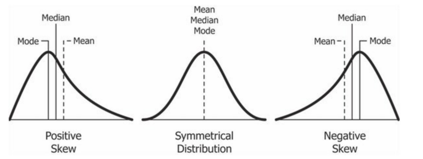
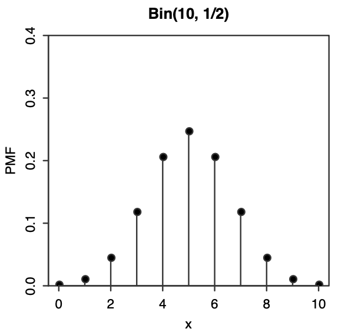
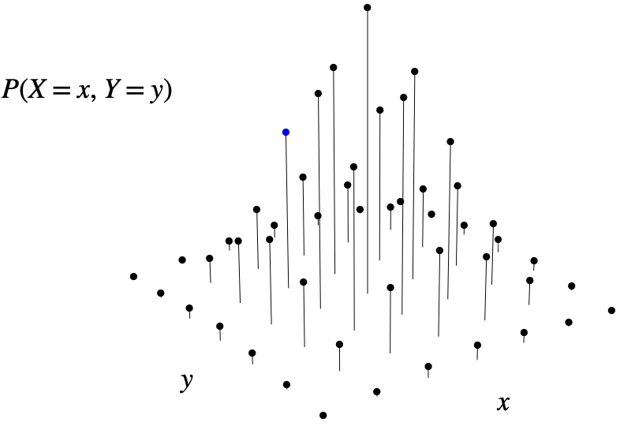
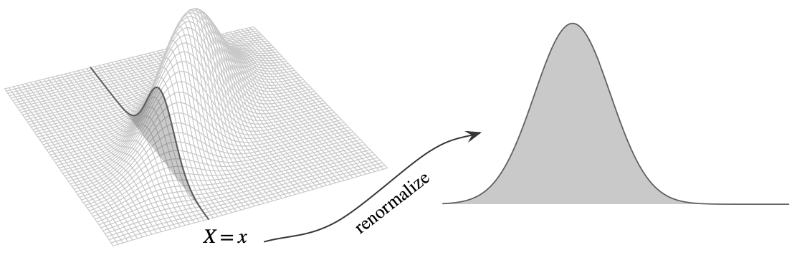
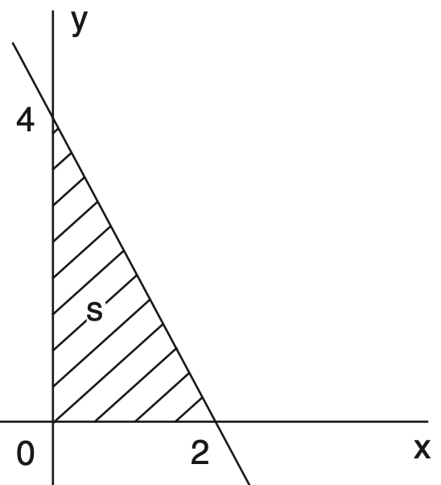
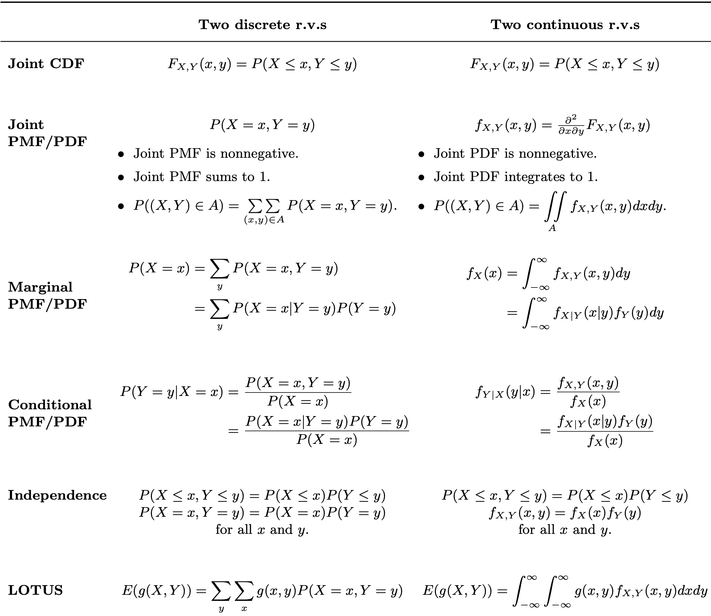

Intuitively, 
- the median is a value $m$ such that half the mass of the distribution falls on either side of $m$ (or as close to half as possible, for discrete r.v.s), and 
- the mode is a value that has the greatest mass or density out of all values in the support of $X$.   
If the CDF $F$ is a continuous, strictly increasing function, then $F^{-1}(1/2)$ is the median (and is unique).

**Example (Standard normal distribution):**
.pull-left[
For $Z\sim N(0,1)$ we have:
- Mean: $E(Z) = 0$
- Median: 0      
The CDF of $Z$ satisfies $\Phi(z)=1-\Phi(-z)$ for all $z$.
In particular, $\Phi(0)=1-\Phi(0)$, which implies $\Phi(0) = 1/2$.
- Mode: 0      
The PDF of $Z$ is maximized when $x=0$.

]

.pull-right[

]

---

**Example (The Median of a Discrete Distribution).**

Suppose that $X$ has the following discrete distribution:
$$\begin{array}{ll}
\operatorname{P}(X=1)=0.1, & \operatorname{P}(X=2)=0.2 \\
\operatorname{P}(X=3)=0.3, & \operatorname{P}(X=4)=0.4
\end{array}$$

The value 3 is a median of this distribution because $\operatorname{P}(X \leq 3)=0.6$, which is greater than $1 / 2$, and $\operatorname{P}(X \geq 3)=0.7$, which is also greater than $1 / 2$. Furthermore, 3 is the unique median of this distribution.

**Example (A Discrete Distribution for Which the Median Is Not Unique)**

Suppose that $X$ has the following discrete distribution:
$$\begin{array}{ll}
\operatorname{P}(X=1)=0.1, & \operatorname{P}(X=2)=0.4 \\
\operatorname{P}(X=3)=0.3, & \operatorname{P}(X=4)=0.2
\end{array}$$

Here, $\operatorname{P}(X \leq 2)=1 / 2$, and $\operatorname{P}(X \geq 3)=1 / 2$. Therefore, every value of $m$ in the closed interval $2 \leq m \leq 3$ will be a median of this distribution. The most popular choice of median of this distribution would be the midpoint 2.5 .

---

**Example (The Median of a Continuous Distribution).** Suppose that $X$ has a continuous distribution for which the PDF is as follows:
$$f(x)= \begin{cases}4 x^3 & \text { for } 0<x<1 \\ 0 & \text { otherwise }\end{cases}$$

The unique median of this distribution will be the number $m$ such that
$$\int_0^m 4 x^3 d x=\int_m^1 4 x^3 d x=x^4\bigg|_m^1=1-m^4=\frac{1}{2}$$

This number is $m=1 / 2^{1 / 4}$.

**Example (A Continuous Distribution for Which the Median Is Not Unique)** Suppose that $X$ has a continuous distribution for which the PDF is as follows:
$$f(x)= \begin{cases}1 / 2 & \text { for } 0 \leq x \leq 1 \\ 1 & \text { for } 2.5 \leq x \leq 3 \\ 0 & \text { otherwise }\end{cases}$$

Here, for every value of $m$ in the closed interval $1 \leq m \leq 2.5$, $\operatorname{P}(X \leq m)=\operatorname{P}(X \geq m)=1 / 2$. Therefore, every value of $m$ in the interval $1 \leq m \leq 2.5$ is a median of this distribution.

---

### Moments

.definition-box[Let $X$ be an r.v. with mean $\mu$ and variance $\sigma^2$. For any positive integer $n$:
- the ** $n$th moment** of $X$ is $E(X^n)$
- the ** $n$th central moment** of $X$ is $E((X-\mu)^n)$
- the ** $n$th standardized moment** of $X$ is $E\bigg(\left(\frac{X-\mu}{\sigma}\right)^n\bigg).$      
Throughout the previous sentence, "if it exists" is left implicit.

]

In particular, the mean is the first moment and the variance is the second central moment. 

The term "moment" is borrowed from physics. The first moment (mean) can be viewed as center of mass, and the variance can be called moment of inertia about the center of mass. 

---

### Skewness

.definition-box[The **skewness** of an r.v. $X$ with mean $\mu$ and variance $\sigma^2$ is the third standardized moment of $X$:
** $$\text{Skew}(X) = E\bigg(\left(\frac{X-\mu}{\sigma}\right)^3\bigg).$$**
]

Why are we standardizing? to make sure that the skewness is not dependent on the location or scale of $X$, i.e. the units are not going to be important.

Skewness is a measure of asymmetry:
* Positive skewness: indicate having a long right tail relative to the left tail.
* Negative skewness: indicate having a long left tail relative to the right tail.

---

### Symmetry

.definition-box[We say that an r.v. $X$ has a **symmetric** distribution **about $\mu$ ** if ** $$X - \mu \text{ has the same distribution as }\mu - X.$$**
]

The number $\mu$ in the above definition must be $E(X)$ if the mean exists, since $E(X) - \mu  = E(X - \mu) = E(\mu - X) = \mu  - E(X)$
implies $E(X) = \mu$.

For $X$ continuous, symmetry means that the PDF of $X$ to the left of $\mu$ is the mirror image of the PDF of $X$ to the right of $\mu$. The same holds for the PMF if $X$ is discrete. For example, $X \sim Bin(n, p)$ is symmetric when $p = 1/2.$

---

### Odd central moments of a symmetric distribution

.theorem-box[
Let $X$ be symmetric about its mean $\mu$. Then for any odd number $m$, the $m$ th central moment $E(X-\mu)^m$ is 0 if it exists.
]

**Proof.**

Since $X-\mu$ has the same distribution as $\mu-X$, they have the same $m$ th moment (if it exists):

$$E(X-\mu)^m=E(\mu-X)^m$$

Let $Y=(X-\mu)^m$. 

Then $(\mu-X)^m=(-(X-\mu))^m=(-1)^m Y=-Y$. 

So the above equation just says $E(Y)=-E(Y)$, which implies $E(Y)=0$.

---

### Moment generating functions (MGF)

A moment generating function, as its name suggests, is a generating function that encodes the *moments* of a distribution.

.definition-box[The **moment generating function (MGF)** of an r.v $X$ is 
** $$M(t) = E(e^{tX})$$ **
if this is finite on some open interval $(-a,a)$ containing 0. Otherwise we say the MGF of $X$ does not exist.
]

**Note:** $M(0) = 1$ for any valid MGF $M$; whenever you compute an MGF, plug in 0 and see if you get 1, as a quick check!

Why do we care about moment generating functions (MGF)?    
The next theorem gives the reason why the MGF is important: the MGF encodes the moments of an r.v. 

---

.theorem-box[**Moments via derivatives of the MGF.** Given the MGF of $X$, we can get the $n$th moment of $X$ by evaluating the $n$th derivative of the MGF at 0: 
** $$E(X^n) = M^{(n)}(0).$$ **
]

**Proof.** Note that the Taylor expansion of $M(t)$ about 0 is
$$M(t)=\sum_{n=0}^{\infty}\color{red}{M^{(n)}(0)}\frac{t^n}{n!}$$
while on the other hand, we also have
$$M(t)=E\left(e^{t X}\right)=E\left(\sum_{n=0}^{\infty} X^n \frac{t^n}{n!}\right)=\sum_{n=0}^{\infty} \color{red}{E\left(X^n\right)} \frac{t^n}{n!}$$

Note we are allowed to interchange the expectation and the infinite sum because certain technical conditions are satisfied (this is where we invoke the condition that $E\left(e^{t X}\right)$ is finite in an interval around 0 ).

Matching the coefficients of the two expansions, we get $E\left(X^n\right)=M^{(n)}(0)$.
---

* MGF of an r.v. determines its distribution, like the CDF and PMF/PDF.

.theorem-box[**MGFs determines the distribution.** If two r.v.s have the same MGF, they must have the same distribution. In fact, if there is even a tiny interval $(-a,a)$ containing 0 on which the MGFs are equal, then the r.v.s must have the same distribution. 
]

* MGF make it easy to find the distribution of a sum of independent r.v.s. If $X$ and $Y$ are independent, then $E(e^{t(X+Y)}) = E(e^{tX})E(e^{tY}).$

.theorem-box[**MGFs of a sum of independent r.v.s.** If $X$ and $Y$ are independent, then the MGF of $X+Y$ is the product of the individual MGFs:
** $$M_{X+Y}(t) =M_{X}(t)M_{Y}(t).$$ **
]

.theorem-box[**MGF of location-scale transformation.** If $X$ has MGF $M(t)$, then the MGF of $a + bX$ is:
** $$E(e^{t(a+bX)})= e^{at}E(e^{btX)})= e^{at}M(bt)$$ **
]

---

**Geometric MGF.** For $X \sim Geom(p)$, 
$$M(t) = E(e^{Xt}) = \sum_{k=0}^{\infty} e^{tk}q^kp = p \sum_{k=0}^{\infty} (e^{t}q)^k = \frac{p}{1-e^tq}$$ since $\sum_{k=0}^{\infty} (e^{t}q)^k$ is a geometric series with ratio $e^tq$. It converges if $e^tq<1$.

**Uniform MGF.** For $U \sim Unif(a,b)$, for $t \neq 0$

$M(t) = E(e^{Ut}) = \int_{a}^{b} e^{tu}\frac{1}{b-a}du =\frac{1}{b-a}\cdot \frac{e^{tu}}{t}\bigg|_{u=a}^{u=b}=\frac{e^{tb}-e^{ta}}{t(b-a)}.$

**Exponential MGF.** First , we find the MGF of $X \sim Expo(1)$. For $t<1$,

$$M_X(t) = E(e^{tX})= \int_{0}^{\infty} e^{tx} e^{-x}dx =  \int_{0}^{\infty} e^{-x(1-t)}dx$$
$$=-\frac{1}{1-t} e^{-x(1-t)}\bigg|_{x=0}^{\infty}-\frac{1}{1-t}(0-1)=\frac{1}{1-t}.$$
Thus the MGF of $Y=X/\lambda\sim Expo(\lambda)$ is: $$M_Y(t)=E(e^{tX/\lambda})=M_X(t/\lambda)=\frac{1}{1-t/\lambda}=\frac{\lambda}{\lambda-t}.$$

---

### Joint CDF

.definition-box[The **joint CDF** of r.v.s $X$ and $Y$ is the function $F_{X,Y}$ given by:
** $$F_{X,Y}(x,y) = P(X \leq  x, Y \leq  y)$$ **
The joint CDF of $n$ r.v.s is defined analogously. 
]

If $X$ and $Y$ are independent, then $F_{XY}(x,y)=F_X(x)F_Y(y)$.

* Discrete r.v.s: CDF doesn't behave nicely, for that, with discrete r.v.s we usually work with the joint PMF.

* Continuous r.v.s:  joint CDF function have to be differentiable with respect to $x$ and $y$. The partial derivative with respect to $x$ and $y$ is called the joint PDF.

---

### Joint PMF

.definition-box[The **joint PMF** of discrete r.v.s $X$ and $Y$ is the function $p_{X,Y}$ given by:
** $$p_{X,Y}(x,y) = P(X = x, Y = y)$$ **
The joint PMf of n discrete r.v.s is defined analogously.
]

.pull-left[
Properties:

* Nonnegative 
* $\sum_x \sum_y P(X = x, Y = y) = 1$
* It can be used to find the probability of the event $(X,Y) \in A$ for any set $A$ of points in the support of $(X,Y).$ 
$$P((X,Y) \in A) = \sum_{x \in A} \sum_{y \in A} P(Y=x,Y=y)$$
]

.pull-right[

]
- If X and Y are independent, then $p_{XY}(x,y)=p_X(x)p_Y(y)$.

---

### Marginal and Conditional PMFs

From the joint distribution of $X$ and $Y$, we can get the distribution of $X$ alone by summing over the possible values of $Y$:

.definition-box[For discrete r.v.s $X$ and $Y$, the **marginal PMF** of $X$ is:
$$P(X=x) = \sum_y P(X=x,Y=y)$$
]

The marginal PMF is just the PMF for a single r.v.s, and hence have the same properties as any other PMF.

.definition-box[For discrete r.v.s $X$ and $Y$, the **conditional PMF of $Y$ given $X=x$ ** is:
** $$P(Y=y|X=x) = \frac{P(X=x,Y=y)}{P(X=x)}$$ **
This is viewed as a function of $y$ for **fixed $x$.**
]

---

**Example.**  Suppose that $X$ and $Y$ have a discrete joint distribution for which the joint PMF is defined as follows:
$$p_{X,Y}(x,y)=\begin{cases}\frac{1}{30}(x+y) & \text { for } x=0,1,2 \text { and } y=0,1,2,3 \\ 0 & \text { otherwise. }\end{cases}$$
a. Determine the marginal PMF's of $X$ and $Y$.      
b. Are $X$ and $Y$ independent?

**Solution.**

(a) For $x=0,1,2$, we have
$$p_X(x)=P(X=x)=\sum_{y=0}^3 f(x, y)=\frac{1}{30}(4 x+6)=\frac{1}{15}(2 x+3)$$

Similarly, for $y=0,1,2,3$, we have
$$p_Y(y)=P(Y=y)=\sum_{x=0}^2 f(x, y)=\frac{1}{30}(3+3 y)=\frac{1}{10}(1+y)$$
(b) $X$ and $Y$ are not independent because it is not true that $p_{XY}(x,y)=p_X(x)p_Y(y)$ for all possible values of $x$ and $y$.

---

### Conditional PMF, Bayes' rule and LOTP

We can also relate the conditional distribution of $Y$ given $X=x$ to that of $X$ given $Y=y$, using Bayes' rule:

.theorem-box[
$$P(Y=y \mid X=x)=\frac{P(X=x \mid Y=y) P(Y=y)}{P(X=x)}$$
]

And using LOTP, we have another way of getting the marginal PMF:

the marginal PMF of $X$ is a weighted average of the conditional PMFs $P(X=x \mid Y=y)$, where the weights are the probabilities $P(Y=y)$.

.theorem-box[
$$P(X=x)=\sum_y P(X=x \mid Y=y) P(Y=y)$$
]

---

### Joint PDF

.definition-box[If $X$ and $Y$ are continuous with joint CDF $F_{X,Y}$ their **joint PDF** is the derivative of the joint CDF with respect to $x$ and $y$:
** $$f_{X,Y}(x,y) = \frac{\partial^2}{\partial x\partial y}F_{X,Y}(x,y)$$ **
The joint PMf of n discrete r.v.s is defined analogously.
]

* $f_{X,Y}(x,y) \geq 0$ and $\int_{-\infty}^{\infty}\int_{-\infty}^{\infty} f_{X,Y}(x,y)dxdy = 1$
* The joint PDF of two r.v.s is the function we integrate to get the probability of a two-dimensional region $A\subseteq \mathbb{R}^2$:
$$P((X,Y) \in A) = \iint_{A} f_{X,Y}(x,y)$$
For example, $P(X<3, 1<Y<4) = \int_{1}^4 \int_{-\infty}^3 f_{X,Y}(x,y)dxdy$
- If $X$ and $Y$ are independent, then $f_{XY}(x,y)=f_X(x)f_Y(y)$.

---

### Marginal PDF

.definition-box[For continuous r.v.s $X$ and $Y$ with joint PDF $f_{X,Y}$, the **marginal PDF** of $X$ is:
** $$f_X(x) = \int_{-\infty}^{\infty} f_{X,Y}(x,y)dy.$$ **
This is the PDF of $X$, viewing $X$ individually rather than jointly with $Y$.
]

Similarly, the marginal PDF of $Y$ is:
** $f_Y(y) = \int_{-\infty}^{\infty} f_{X,Y}(x,y)dx.$ **

Marginalization works analogously with any number of variables. Integrate over the unwanted variables to get the joint PDF of the wanted variables.

For example, if we have the joint PDF of $X, Y, Z, W$ but want the joint PDF of $X, W$, we just have to integrate over all possible values of $Y$ and $Z$ :
$$f_{X, W}(x, w)=\int_{-\infty}^{\infty} \int_{-\infty}^{\infty} f_{X, Y, Z, W}(x, y, z, w) d y d z$$

---

### Conditional PDF

.definition-box[
For continuous r.v.s $X$ and $Y$ with joint PDF $f_{X,Y}$, the **conditional PDF of $Y$ given $X=x$ ** is:
** $$f_{Y|X}(y|x) = \frac{f_{X,Y}(x,y)}{f_X(x)},$$ **
for all x with $f_X(x) > 0$ and $f_{Y|X}(y|x) = 0$ for all $x$ with $f_X(x) = 0.$
This is viewed as a function of $y$ for **fixed $x$.**
]

.pull-left[
Take a vertical slice of the joint PDF corresponding to the observed value of $X$. Since the total area under this slice is $f_X(x)$, we then divide by $f_X(x)$ to ensure that the conditional PDF will have an area of 1. 
]

.pull-right[

]

---

**Example.** Suppose that the joint PDF of two random variables $X$ and $Y$ is as follows:
$$f_{X,Y}(x, y)=\left\{\begin{array}{lc}
\frac{3}{16}(4-2 x-y) & \text { for } x>0, y>0 \text { and } 2 x+y<4 \\
0& \text {otherwise }
\end{array}\right.$$

Determine: (a) the conditional PDF of $Y$ for every given value of $X$, and        
(b) $\operatorname{P}(Y \geq 2 \mid X=0.5)$.

**Solution.** 
.pull-left[
(a) The joint PDF of $X$ and $Y$ is positive inside the triangle $S$ shown in the figure. We can see the possible values of $X$ lie between 0 and 2.      
Hence, for $0<x<2$,
]

.pull-right[

]

$$f_X(x)=\int_0^{4-2 x} f_{X,Y}(x, y) d y=\int_0^{4-2 x} \frac{3}{16}(4-2 x-y) d y$$

---

$$\Rightarrow f_X(x)=\int_0^{4-2 x} \frac{3}{16}(4-2 x-y) d y = \frac{3}{16}(4y-2 xy-\frac{1}{2}y^2)\bigg|_0^{y=4-2x}$$

$$=\frac{3}{16}\left(4(4-2x)-2x(4-2x)-\frac{1}{2}(4-2x)^2\right)=\frac{3}{8}(x-2)^2$$

It follows that for $0<x<2$ and $0<y<4-2 x$,
$$f_{Y|X}(y|x) = \frac{f_{X,Y}(x,y)}{f_X(x)}=\frac{\frac{3}{16}(4-2 x-y)}{\frac{3}{8}(x-2)^2}=\frac{4-2 x-y}{2(x-2)^2}$$
(b) When $X=0.5$ and $0<y<4-2 x=3$ it follows from part (a) that

$$f_{Y|X}(y|0.5) =\begin{cases}\frac{4-2(0.5)-y}{2(0.5-2)^2}=\frac{2}{9}(3-y) & \text { for } 0<y<3 \\ 0 & \text { otherwise }\end{cases}$$

Therefore,
$$\operatorname{P}\left(Y \geq 2 \left\lvert\, X=\frac{1}{2}\right.\right)=\int_2^3 f_{Y|X}(y|0.5) d y=\int_2^3\frac{2}{9}(3-y) d y=\frac{1}{9}.$$
---

### Continuous form of Bayes' rule and LOTP

For continuous r.v.s $X$ and $Y$, we have the following continuous form of Bayes' rule:
** $$f_{Y \mid X}(y \mid x)=\frac{f_{X \mid Y}(x \mid y) f_Y(y)}{f_X(x)}, \text { for } f_X(x)>0$$ **

And we have the following continuous form of the law of total probability:
** $$f_X(x)=\int_{-\infty}^{\infty} f_{X \mid Y}(x \mid y) f_Y(y) d y$$ **

**Proof.** By definition of conditional PDFs, we have
$$f_{Y \mid X}(y \mid x) f_X(x)=f_{X, Y}(x, y)=f_{X \mid Y}(x \mid y) f_Y(y)$$

The cont. version of Bayes' rule follows immediately from dividing by $f_X(x)$. The cont. version of LOTP follows from integrating with respect to $y$ :
$$f_X(x)=\int_{-\infty}^{\infty} f_{X, Y}(x, y) d y=\int_{-\infty}^{\infty} f_{X \mid Y}(x \mid y) f_Y(y) d y$$
---

### Other versions of Bayes' rule and LOTP 

We now have versions of Bayes' rule and LOTP for two discrete r.v.s and for two continuous r.v.s. 

There are also versions when we have one discrete r.v. and one continuous r.v. After understanding the discrete versions, it is easy to remember and use the other versions since they are analogous, replacing probabilities by PDFs when appropriate.

For example, for ** $X$ discrete and $Y$ continuous**, we have the following version of LOTP:
** $$P(X=x)=\int_{-\infty}^{\infty} P(X=x \mid Y=y) f_Y(y) d y$$ **

Taking $X$ to be the indicator r.v. of an event $A$ and $x=1$, we have an expression for a general probability $P(A)$ based on conditioning on a continuous r.v. $Y$ :
** $$P(A)=\int_{-\infty}^{\infty} P(A \mid Y=y) f_Y(y) d y$$ **

---

### Four versions of Bayes' rule

Here are the four versions of Bayes' rule, summarized in a table.
$$\small{\begin{array}{|c|c|c|}
\hline
& \textbf{Y discrete} & \textbf{Y continuous} \\
\hline
\textbf{X discrete} &P(Y = y|X = x)=\frac{P(X = x|Y = y)P(Y = y)}{P(X = x)} &f_Y(y|X = x)=\frac{P(X = x|Y = y) f_Y(y)}{P(X = x)} \\
\hline
\textbf{X continuous} &P(Y = y|X = x)=\frac{f_X(x|Y = y) P(Y = y)}{f_X(x)} &f_{Y|X}(y|x)=\frac{f_{X|Y}(x|y) f_Y(y)}{f_X(x)} \\
\hline
\end{array}}$$

<h3> Four versions of LOTP </h3>

Here are the four versions of LOTP. The top row gives expressions for $P(X = x)$, while the bottom row gives expressions for $f_X(x)$.

$$\small{\begin{array}{|c|c|c|}
\hline
& \textbf{Y discrete} & \textbf{Y continuous} \\
\hline
\textbf{X discrete} & \sum_y P(X = x | Y = y) P(Y = y) & \int_{-\infty}^{\infty} P(X = x | Y = y) f_Y(y) dy \\
\hline
\textbf{X continuous} & \sum_y f_X(x | Y = y) P(Y = y) & \int_{-\infty}^{\infty} f_{X|Y}(x|y) f_Y(y) dy \\
\hline
\end{array}}$$

---

### 2D Lotus

Like its 1D counterpart, 2D LOTUS saves us from having to find the distribution of $g(X,Y)$ in order to calculate its expectation. Instead, having the joint PMF or joint PDF of X and Y is enough.

.theorem-box[Let g be a function from $\mathbb{R}^2$ to $\mathbb{R}$. If $X$ and $Y$ are discrete, then:
** $$E(g(X,Y)) = \sum_x\sum_y g(x,y) P(X=x,Y=y).$$ **
If $X$ and $Y$ are continuous with joint PDF $f_{X,Y}$ then:
** $$E(g(X,Y)) = \int^{\infty}_{-\infty}\int^{\infty}_{-\infty} g(x,y)f_{X,Y}(x,y)dxdy.$$ **
]

---

---

### Additional Practice Problems

**1.** Consider two r.v.s $X$ and $Y$ with joint PMF given by:

|       | X = 0  | X = 1  |
| ----- |:------:| ------:|
| Y = 0 | 1/6    | 1/8    |
| Y = 1 | 1/4    | 1/6    |
| Y = 2 | 1/8    | 1/6    |

a. Find $P(X =0, Y \leq 1)$.      
b. Find the marginal PMF of $Y$, $P(Y =y)$.      
c. Find $P(Y = 1  | X = 0)$.    
d. Are $X$ and  $Y$ independent?      
**2.** Suppose that $X$ and $Y$ have a continuous joint distribution for which the joint PDF is defined as follows:
$$f(x, y)= \begin{cases}c y^2 & \text { for } 0 \leq x \leq 2 \text{ and }  0 \leq y \leq 1\\ 0 & \text { otherwise }\end{cases}$$
Determine (a) the value of the constant $c$;      
(b) $\operatorname{P}(X+Y>$ 2); (c) $\operatorname{P}(Y<1 / 2)$; (d) $\operatorname{P}(X \leq 1)$.       
**3.** Let $X$ and $Y$ be iid Unif(0,1) r.v.s. Find $E(|X-Y|)$.

