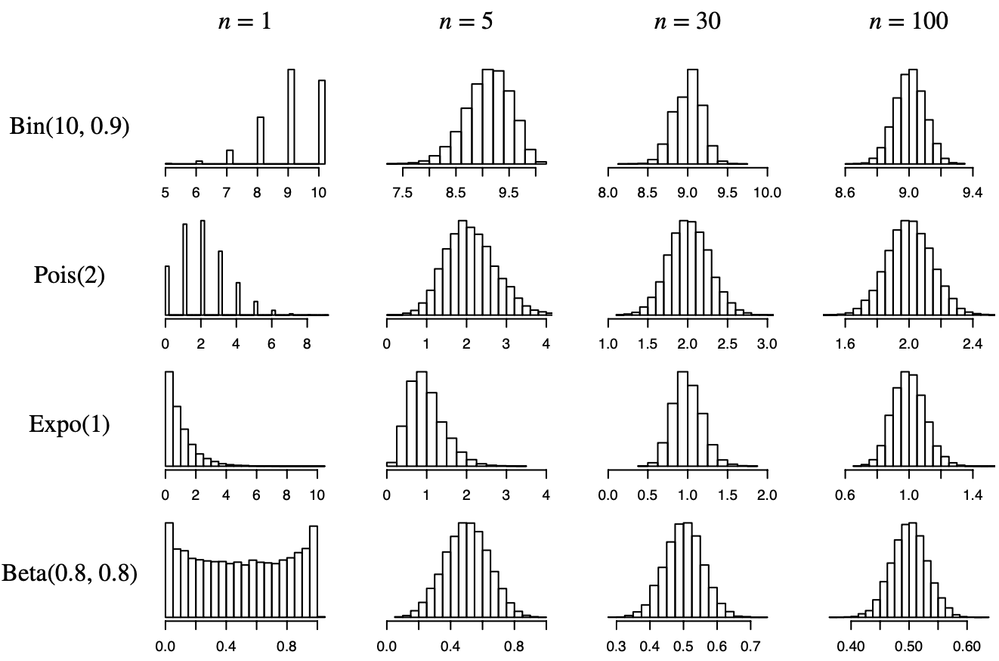

### Conditional expectation given an event


.definition-box[Let $A$ be an event with positive probability. 
- If $Y$ is discrete r.v., then the conditional expectation of $Y$ given $A$ is:
** $$E(Y|A) = \sum_{y}y P(Y=y|A),$$ **
where the sum is over the support of $Y$. 
- If $Y$ is continuous r.v. with PDF $f$, then:
** $$E(Y|A) = \int_{-\infty}^{\infty}y f(y|A)dy,$$ **
where the conditional PDF ** $f(y|A)$ ** is defined as the derivative of the conditional CDF, ** $F(y|A) = P(Y \leq y | A),$ **
and can also be computed by a hybrid version of Bayes’ rule: ** $$f(y|A) = \frac{P(A|Y = y)f(y)}{P(A)}.$$ **
]

---

### Confusing conditional expectation and unconditional expectation

Confusing conditional expectation and unconditional expectation is a dangerous mistake. More generally, not keeping careful track of what you should be conditioning on and what you are conditioning on is a recipe for disaster.

**Example:** Sandra is 30 years old, and she hears that the average life expectancy in her country is 80 years. Should she conclude that, on average, she has 50 years of life left? 

The answer is no, since there's a crucial piece of information that she must condition on: the fact that she has lived to age 30 already. 

If we denote $T$ as Sandra's lifespan (expectancy at birth), we have that:
** $$E(T) < E(T | T \geq 30)$$ **
The left-hand side is Sandra’s life expectancy at birth (it implicitly conditions on the fact that she is born), and the right-hand side is Sandra’s life expectancy given that she reaches age 30.

In this case $T \geq 30$ is the event $A$ that we are conditioning on.


---

### Law of total expectation

.theorem-box[Let $A_1, ..., A_n$ be a partition of a sample space, with $P(A_i) > 0$ for all i, and let $Y$ be a random viarable on this sample space. Then:
** $$E(Y)= \sum_{i=1}^{n}E(Y|A_i)P(A_i).$$ **
]

The following example uses first-step analysis to derive the expectation of the Geometric distribution.

**Example.** Let $X \sim \operatorname{Geom}(p)$. Interpret $X$ as the number of Tails before the first Heads in a sequence of coin flips with probability $p$ of Heads. 

$$E(X) = E(X \mid \text{first toss H})\cdot p + E(X \mid \text{first toss T})\cdot q$$
$$E(X) = 0\cdot p + (1+E(X))\cdot q = q + qE(X)$$
$$\Rightarrow E(X) - q\cdot E(X) =q \Rightarrow (1-q)\cdot E(X) =q \Rightarrow E(X) = \frac{q}{1-q}=\frac{q}{p}.$$

---

### Conditional expectation given an r.v.

The key to understanding $E(Y \mid X)$ where $X$ and $Y$ are both r.v.s is first to understand $E(Y \mid X=x)$. Since $X=x$ is an event, $E(Y \mid X=x)$ is just the conditional expectation of $Y$ given this event, and it can be computed using the conditional distribution of $Y$ given $X=x$.         
If $Y$ is discrete, we use the conditional PMF $P(Y=y \mid X=x)$ in place of the unconditional PMF $P(Y=y)$ :
** $$E(Y \mid X=x)=\sum_y y P(Y=y \mid X=x)$$ **
Analogously, if $Y$ is continuous, we use the conditional $\operatorname{PDF} f_{Y \mid X}(y \mid x)$ in place of the unconditional PDF:
** $$E(Y \mid X=x)=\int_{-\infty}^{\infty} y f_{Y \mid X}(y \mid x) d y$$ **
Notice that because we sum or integrate over $y, E(Y \mid X=x)$ is a function of $x$ only. We can give this function a name, like $g$ : let  ** $g(x)=E(Y \mid X=x)$.** We define $E(Y \mid X)$ as the random variable obtained by finding the form of the function $g(x)$, then plugging in $X$ for $x$.

---

### Conditional expectation given an r.v.

.definition-box[Let $$g(x) = E(Y|X = x)=\begin{cases}\sum_y y P(Y=y \mid X=x) & \text { if } X \text{ is discrete} \\ \int_{-\infty}^{\infty} y f_{Y \mid X}(y \mid x) d y & \text{ if } X \text{ is continuous}\end{cases}$$ 

Then the **conditional expectation of $Y$ given $X$ **, denoted by $E(Y|X)$, is defined to be the random variable ** $g(X)$**.
]

By definition, $E(Y \mid X)$ is a function of $X$, so it is a random variable. (This does not mean there are no examples where $E(Y \mid X)$ is a constant. A constant is a degenerate r.v., and a constant function of $X$. For example, if $X$ and $Y$ are independent then $E(Y \mid X)=E(Y)$, which is a constant.)     
Thus it makes sense to compute quantities like $E(E(Y \mid X))$ and $\operatorname{Var}(E(Y \mid X))$, the mean and variance of the r.v. $E(Y \mid X)$.        
Important to keep in mind: ** conditional expectations of the form $E(Y \mid A)$ are numbers, while those of the form $E(Y \mid X)$ are random variables**.

---

**Example.** A stick of length 1 is broken at a point $X$ chosen uniformly at random. Given that $X=x$, we then choose another breakpoint $Y$ uniformly on the interval $[0, x]$. Find $E(Y \mid X)$, and its mean and variance.

**Solution:**
From the description of the experiment, $X \sim \operatorname{Unif}(0,1)$ and $Y \mid X=x \sim \operatorname{Unif}(0, x)$. 

Recall that $U\sim\operatorname{Unif}(a,b)$ has $E(U)=\frac{a+b}{2}$ and $\operatorname{Var}(U)=\frac{(b-a)^2}{12}$.  
Then $g(x)=E(Y \mid X=x)=\frac{x}{2}=\frac{0+x}{2}$. 

By plugging in $X$ for $x$, we have
$$g(X)=E(Y \mid X)=X / 2.$$

The expected value of $E(Y \mid X)$ is
$$E(E(Y \mid X))=E(X / 2)=\frac{1}{2}E(X)=\frac{1}{4}.$$
The variance of $E(Y \mid X)$ is
$$\operatorname{Var}(E(Y \mid X))=\operatorname{Var}(X / 2)=\left(\frac{1}{2}\right)^2\operatorname{Var}(X)=\frac{1}{4}\cdot \frac{1}{12}= \frac{1}{48}.$$


---

### Properties of conditional expectation

.theorem-box[
**Dropping what's independent.** If $X$ and $Y$ are independent, then $$E(Y \mid X)=E(Y).$$
]

Independence implies $E(Y \mid X=x)=E(Y)$ for all $x$, thus $E(Y \mid X)=E(Y)$. 


.theorem-box[**Taking out what's known.** For any function $h$,
$$E(h(X) Y \mid X)=h(X) E(Y \mid X)$$
]

This is the conditional version of the unconditional fact that $E(c Y)=c E(Y)$. The difference is that $E(c Y)=c E(Y)$ asserts that two numbers are equal, while taking out what's known asserts that two random variables are equal.

Intuitively, when we take expectations given $X$, we are treating $X$ as if it has crystallized into a known constant. Then any function of $X$, say $h(X)$, also acts like a known constant while we are conditioning on $X$. 

---
The following example illustrates that we can have $E(Y |X) = E(Y)$ doesn't imply $X$ and $Y$ are independent.
That is, we can have $E(Y |X) = E(Y)$ for dependent r.v.s $X$ and $Y$.

**Example.** Let $Z \sim \mathcal{N}(0,1)$ and $Y=Z^2$. Find $E(Y \mid Z)$ and $E(Z \mid Y)$.

**Solution:** Since $Y$ is a function of $Z$, 
$$E(Y \mid Z)=E\left(Z^2 \mid Z\right)=Z^2.$$ 

To get $E(Z \mid Y)$, notice that conditional on $Y=y, Z$ equals $\sqrt{y}$ or $-\sqrt{y}$ with equal probabilities by the symmetry of the standard Normal.

Thus $$E(Z \mid Y=y)=0 \text{ and } E(Z \mid Y)=0.$$

Thus we have $E(Z \mid Y)=E(Z)=0$ despite the dependence between $Z$ and $Y$. 

---

.theorem-box[
**Linearity.** Let $X,Y, Y_1,Y_2$ be r.v.s and $c$ a constant. Then
- $E\left(Y_1+Y_2 \mid X\right)=E\left(Y_1 \mid X\right)+E\left(Y_2 \mid X\right)$ and 
- $E(cY \mid X) = cE(Y \mid X).$
]

The next theorem connects conditional expectation to unconditional expectation.

.theorem-box[
**Adam’s law/ Tower Property.** For any r.v.s $X$ and $Y$, $$E(E(Y \mid X)) = E(Y ).$$
]

Adam's law is a more compact, more general version of the law of total expectation (Theorem 9.1.5). For $X$ discrete, the statements $$E(Y)=\sum_x E(Y \mid X=x) P(X=x) \text{ and }E(Y)=E(E(Y \mid X))$$
mean the same thing, since if we let $E(Y \mid X=x)=g(x)$, then $$E(E(Y \mid X))=E(g(X))=\sum_x g(x) P(X=x)=\sum_x E(Y \mid X=x) P(X=x).$$
 

---

**Example.** A disoriented miner finds themselves in a room of the mine with three doors:
- The first door brings them to safety after a 3 hours long hike.
- The second door takes them back to the same room after 5 hours of
climbing.
- The third door takes them again back to the same room after 7 hours
of exhausting climbing.
The disoriented miner chooses one of the three doors with equal chance independently each time they are in that room.
What is the expected time after which the miner is safe?

**Solution.** 

Let $X$ the initial choice of a door $(=1,2,3)$ and $Y$ be the time to reach safety. Then $E Y= E(E(Y \mid X))$
$$= E(Y| X=1)P(Y=1)+E(Y| X=2)P(X=2)+E(Y| Y=3)P(Y=3)$$
$$\Rightarrow EY=3 \cdot \frac{1}{3}+(E Y+5) \cdot \frac{1}{3}+(E Y+7) \cdot \frac{1}{3}$$
$$\Rightarrow 3 E Y = 15 + 2 EY \Rightarrow E Y=15$$

---

**Example.** Let $X_1, \ldots, X_n$ be i.i.d., and $S_n=X_1+\cdots+X_n$.      
Find $E\left(X_1 \mid S_n\right)$.

**Solution:** By symmetry,
$$E\left(X_1 \mid S_n\right)=E\left(X_2 \mid S_n\right)=\cdots=E\left(X_n \mid S_n\right)$$
and,
$$S_n=E\left(S_n \mid S_n\right)=E(X_1+\cdots+X_n|S_n)=E\left(X_1 \mid S_n\right)+\cdots+E\left(X_n \mid S_n\right)$$
by linearity.
Therefore,
$$nE\left(X_1 \mid S_n\right)=S_n\Rightarrow E\left(X_1 \mid S_n\right)=\frac{S_n}{n}=\bar{X}_n$$
the sample mean of the $X_j$ 's. 

NOTE. This is an intuitive result: if we have 2 i.i.d. r.v.s $X_1, X_2$ and learn that $X_1+X_2=10$, it makes sense to guess that $X_1$ is 5 (accounting for half of the total). Similarly, **if we have $n$ i.i.d. r.v.s and get to know their sum, our best guess for any one of them is the sample mean.**

---
### Conditional Variance

.definition-box[
The **conditional variance of $Y$ given $X$ ** is:
$$Var(Y|X) = E[(Y - E(Y|X))^2|X] = E(Y^2|X) - E(Y|X)^2$$
]

There is a very useful relationship between $\operatorname{Var}(Y)$, the unconditional variance of $X$, and $\operatorname{Var}(Y \mid X)$, the conditional variance of $Y$ given $X$, that can often be applied to compute $\operatorname{Var}(Y)$. We have
$$\operatorname{Var}(Y \mid X)=E\left[Y^2 \mid X\right]-(E[Y \mid X])^2$$
$\Rightarrow E[\operatorname{Var}(Y \mid X)] =E\left[E\left[Y^2 \mid X\right]\right]-E\left[(E[Y \mid X])^2\right]$
** $$\Rightarrow E[\operatorname{Var}(Y \mid X)] =E\left[Y^2\right]-E\left[(E[Y \mid X])^2\right]$$ **
since $E\left[E\left[Y^2 \mid X\right]\right]=E\left[Y^2\right]$ by Adam's Law. Also, $E[E[Y \mid X]]=E[Y]$ 
** $$\Rightarrow\operatorname{Var}(E[Y \mid X])=E\left[(E[Y \mid X])^2\right]-(E[Y])^2.$$ **
By adding the above equations, we arrive at the following proposition.

---

.theorem-box[
**Eve's Law (Law of Total Variance or the Variance Decomposition Formula)** 
For any r.v.s $X$ and $Y$, 
** $$\operatorname{Var}(Y)=E(\operatorname{Var}(Y \mid X))+\operatorname{Var}(E(Y \mid X))$$ **
]

Note the ordering of E's and Var's on the right-hand side spells EVVE. 


Imagine a population where each person has a value of $X$ and a value of $Y$. We can divide this population into subpopulations, one for each possible value of $X$. For example, if $X$ represents age and $Y$ represents height, we can group people based on age.

Then there are two sources contributing to the variation in people's heights in the overall population:
- First, within each age group, people have different heights. The average amount of variation in height within each age group is the within-group variation, ** $E(\operatorname{Var}(Y \mid X))$. **
- Second, across age groups, the average heights are different. The variance of average heights across age groups is the between-group variation, ** $\operatorname{Var}(E(Y \mid X))$.** 

Eve's law says that to get the total variance of $Y$, we simply add these two sources of variation.

---

**Example.** Draw a county at random from the United States. Then draw $n$ people at random from the county. Let $X$ be the number of those people who have a certain disease. If $Q$ denotes the proportion of people in that county with the disease, then $Q$ is also a random variable since it varies from county to county. We have that ** $X\mid Q=q \sim \operatorname{Binomial}(n, q)$.**     
Thus, $E(X \mid Q=q)=n q$ and $\operatorname{Var}(X \mid Q=q)=n q(1-q)$.     

Suppose that the random variable $Q$ has a Uniform $(0,1)$ distribution. That is, ** $Q \sim \operatorname{Unif}(0,1)$. ** 
Thus, $E(Q)=\frac{0+1}{2}=1/2, \operatorname{Var}(Q)=\frac{(1-0)^2}{12}=1/12$ and $E(Q^2) = (EQ)^2+\operatorname{Var}(Q)= (1/2)^2+(1/12)=1/3$.

We compute the expected value and the variance of $X$.  

$E(X)=E E(X \mid Q)=E(n Q)=n E(Q)=n\cdot (1/2)=n / 2$. 

First, $E\operatorname{Var}(X \mid Q)=E[n Q(1-Q)]=n E[Q(1-Q)]=n E(Q-Q^2)$
$$=n\left(EQ-EQ^2\right)=n\left(1/2-1/3\right)=n / 6.$$
Next, $\operatorname{Var} E(X \mid Q)=\operatorname{Var}(n Q)=n^2 \operatorname{Var}(Q)=n^2 / 12$.    
By Eve's Law, $\operatorname{Var}(X)=E\operatorname{Var}(X \mid Q)+\operatorname{Var}E(X \mid Q)=\operatorname{Var}(X)=(n / 6)+\left(n^2 / 12\right).$


---

### Probability inequalities

Probability inequalities provide definitive limits on the range of possible values for a given probability. 

These mathematical tools are crucial in probability theory, as they allow us to establish concrete upper and lower boundaries for probabilities we're investigating. 

While these bounds may not always offer precise estimates, they do guarantee that the true probability lies within the specified range. For instance, if we determine that a probability falls between 0.2 and 0.6, we can be certain that the exact value is somewhere within this interval, even if we can't pinpoint it more precisely. 

This approach gives us a reliable framework for understanding and analyzing probabilities, even when exact calculations are challenging or impossible.

---

### Markov's Inequality

.theorem-box[
For any r.v. $X$ and constant $a>0$,
** $$P(|X| \geq a) \leq \frac{E|X|}{a}$$ **
]

**Proof.** Let $Y=\frac{|X|}{a}$. Then $E(Y)=E\left(\frac{|X|}{a}\right)=\frac{E|X|}{a}.$

That is, we need to show that $P(Y \geq 1) \leq E(Y)$. 

Consider the indicator random variable $I_{Y \geq 1}=\begin{cases}1 & \text{if } Y \geq 1\\ 0 & \text{if } Y < 1 \end{cases}$

Note that $I_{Y \geq 1} \leq Y$ since if $I_{Y \geq 1}=0$ then the inequality reduces to $Y \geq 0$, and if $I_{Y \geq 1}=1$ then $Y \geq 1$. Taking the expectation of both sides, we have $$EI_{Y \geq 1} =P(Y \geq 1)\leq EY.$$

---

### Markov's Inequality intuitive interpretation

Let $X$ be the income of a randomly selected individual from a population. 

Taking $a=2 E(X)$, Markov's inequality says that $$P(X \geq 2 E(X)) \leq \frac{E(X)}{a}=\frac{E(X)}{2 E(X)}= 1 / 2,$$ i.e., it is impossible for more than half the population to make at least twice the average income. 

This is clearly true, since if over half the population were earning at least twice the average income, the average income would be higher! 

Similarly, $P(X \geq 3 E(X)) \leq 1 / 3.$ That is, you can't have more than $1 / 3$ of the population making at least three times the average income, since those people would already drive the average above what it is.

The following two inequalities, which requires some additional assumptions about $X$, can be derived from Markov’s inequality with almost no additional work, can often give us bounds that are much better than Markov’s.


---

### Chebyshev's Inequality


.theorem-box[
Let $X$ have mean $\mu$ and variance $\sigma^2$. Then for any $a>0$,
** $$P(|X-\mu| \geq a) \leq \frac{\sigma^2}{a^2}$$ **
]

**Proof.** By Markov's inequality,
$$P(|X-\mu| \geq a)=P\left((X-\mu)^2 \geq a^2\right) \leq \frac{E(X-\mu)^2}{a^2}=\frac{\sigma^2}{a^2}.$$  

----

Substituting $c \sigma$ for $a$, for $c>0$, we obtain an **upper bound on the probability of an r.v. being more than $c$ standard deviations away from its mean**:
** $$P(|X-\mu| \geq c \sigma) \leq \frac{1}{c^2}.$$ **

For example, there can't be more than a $25 \%$ chance of being 2 or more standard deviations from the mean.

---

### Chernoff bound

While Markov's inequality is not sharp in many cases, there are many ways of strengthening it. 

Here is a commonly used argument called Chernoff bound. Let $X$ be any random variable with finite moment generating function $M$.

Then for any $a \in \mathbb{R}$ and $t>0$,
** $$P(X \geq a)=P\left(\mathrm{e}^{t X} \geq \mathrm{e}^{t a}\right) \leq \frac{Ee^{t X}}{\mathrm{e}^{t a}}=\mathrm{e}^{-t a} M(t)$$ **
where Markov's inequality was applied on $\mathrm{e}^{t X} \geq 0$. 

Minimizing the right hand-side in $t$ can give rather sharp estimates in many cases.

---

**Example.** Let $Z \sim N (0, 1)$. By the $68-95-99.7\%$ rule, we know that $P(|Z| > 3)$ is approximately 0.003; the exact value is $2\cdot \Phi(-3)$. 

By Chernoff (after using symmetry of the Normal):
$$P(|Z| > 3) = 2P(Z > 3) \leq  2e^{-3t}E(e^{tZ}) = 2e^{−3t} \cdot  e^{t^2/2}=2e^{t^2/2−3t},$$
using the MGF of the standard Normal distribution.

The right-hand side is minimized at $t = 3$, as found by setting the derivative equal to 0:
$$\frac{d}{dt}\left(2e^{t^2/2−3t}\right)=2e^{t^2/2−3t}\cdot (t-3)=0\Rightarrow t=3.$$


Plugging in $t = 3$, we have
$$P (|Z| > 3) ≤ 2e^{−9/2} \approx 0.022.$$
Markov’s inequality tells us that the tail probability $P(|Z| > 3)$ is at most 0.27, but it would be incorrect to say that $P(|Z| > 3)$ is approximately 0.27 as we’d be off by a factor of about 100.


---

### Law of Large Numbers

Assume we have iid $X_1, X_2, X_3, ...$ with finite mean $\mu$ and finite variance $\sigma^2$. For all positive integers $n$, let:

** $$\bar{X}_n = \frac{X_1 + \dots + X_n}{n}$$ **
be the sample mean of $X_1$ through $X_n$. The sample mean is itself a r.v. with mean $\mu$ and variance $\sigma^2/n$:

$$E(\bar{X}_n)=\frac{1}{n}E(X_1 + \cdots + X_n) = \frac{1}{n}E(X_1) + \cdots + E(X_n) = \mu$$
$$Var(\bar{X}_n)=\frac{1}{n^2}Var(X_1 + \cdots + X_n) = \frac{1}{n^2}Var(X_1) + \cdots + Var(X_n) = \sigma^2/n$$
Law of Large Numbers (LLN) says that **as $n$ grows, the sample mean $\bar{X}_n$ converges to the true mean $\mu$. ** There are two versions: strong (SLLN) or weak (WLLN).

---

### Strong Law of Large Numbers (SLLN)

The law of large numbers is a fundamental principle that underpins much of modern simulation, statistical analysis, and scientific research. It comes into play whenever we generate extensive datasets through repeated independent trials, whether these are conducted via computer simulations or real-world experiments. The LLN is implicitly invoked each time we use the mean value from these multiple trials to estimate the theoretical average of a particular quantity. 


.theorem-box[
The sample mean $\bar{X}_n$ converges to the true mean $\mu$ pointwise, with probability 1. Recalling that r.v.s are functions from the same space $S$ to $\mathbb{R}$, this form of convergence says that $\bar{X}_n(s) \rightarrow \mu$ for each point $s \in S$, except that the convergence is allowed to fail on some set $B_0$ of exceptions, as long as $P(B_0) = 0$. In short:
** $$P(\bar{X}_n \rightarrow \mu) = 1.$$ **

Can also be written as $P\left(\displaystyle\lim_{n \to \infty } \bar{X}_n = \mu\right) = 1$
]

---

### Weak Law of Large Numbers (WLLN)

.theorem-box[
For all $\epsilon > 0$, ** $P(|\bar{X}_n-\mu|>\epsilon)\rightarrow 0 \text{ as } n\rightarrow \infty.$ **
]

This form of convergence is called convergence in probability.

**Proof of WLLN.** Fix $\epsilon > 0$. By Chebyshev’s inequality, applied to the sample mean r.v. $\bar{X}_n$ (which has mean $\mu$ and variance $\sigma^2/n$),
$$P(|\bar{X}_n-\mu|>\epsilon) \leq \frac{\frac{\sigma^2}{n}}{e^2}=\frac{\sigma^2}{ne^2}.$$
 
As $n \rightarrow \infty$, the right-hand side goes to 0, and so must the left-hand side.

---

**Example.** Let $X_1, X_2, ...$ be iid $Bern(1/2)$. Interpreting the $X_j$ as an indicator of Heads in a string of fair coin tosses, $\bar{X}_n$ is the proportion of Heads after $n$ tosses. 
* The SSLN says that with probability 1, when the sequence of r.v.s $\bar{X}_1,\bar{X}_2,\bar{X}_3, ...$ crystallizes into a sequence of numbers, then that sequence of numbers will converge to $1/2$. 
* Mathematically, there are bizarre outcomes such as all heads, or HHT repeated over an over infinitely, among others, but collectively, they have zero probability of occurring. 
* The WLLN says that for any $\epsilon>0$, the probability of $\bar{X}_n$ being more than $\epsilon$ away from $1/2$ can be made as small as we like by letting $n$ grow.
```{r echo=FALSE, fig.height=4, fig.width=6}
set.seed(1010)
nsim <- 300  
p <- 1/2  
x <- rbinom(nsim,1,p)  
#Then we compute X bar for each value of n and store the results in xbar:  
xbar <- cumsum(x)/(1:nsim)  
plot(1:nsim,xbar,type="l",ylim=c(0,1), xlab= "number of tosses", ylab="running proportion of Heads") 
abline(h = 0.5, col="red")
```

---

### Central Limit Theorem (CLT)

Assume we have iid $X_1, X_2, X_3, ...$ with **finite mean $\mu$ and finite variance $\sigma^2$.** For all positive integers $n$, let:
$\bar{X}_n = \frac{X_1 + \dots + X_n}{n}$ be the sample mean.
* Law of Large Numbers (LLN) tells us that $\bar{X}_n \rightarrow \mu$ as $n \rightarrow \infty$. But given that $\bar{X}_n$ is a r.v., what happens with its distribution?
* CLT can help us approximate a distribution for $\bar{X}_n$. 
* CLT states that for large $n$, the distribution of $\bar{X}_n$ after standardization (i.e. subtract $\mu$, the mean of $\bar{X}_n$, and divide by $\frac{\sigma}{\sqrt{n}}$, the standard deviation of $\bar{X}_n$) approaches a standard Normal distribution. 

.theorem-box[
**CLT.** As $n \rightarrow \infty$, 
** $$\frac{\bar{X}_n-\mu}{\sigma\sqrt{n}}\rightarrow N(0,1)$$ **
This means that the CDF of the r.v $\frac{\bar{X}_n-\mu}{\sigma\sqrt{n}}$ converges to $\Phi$, the CDF
of the standard Normal distribution.
]

---

### Central Limit Theorem

.theorem-box[
**CLT, approximation form.** For large $n$, the distribution of $\bar{X}_n$ is approximately $N(\mu, \sigma^2/n)$. We denote this by ** $\bar{X}_n \dot{\sim} N(\mu, \sigma^2/n)$. **
]


The CLT says that the sample mean $\bar{X}_n$ is approximately Normal, but since the sum ** $$W_n=X_1+\cdots+X_n=n \bar{X}_n$$ ** is just a scaled version of $\bar{X}_n$, the CLT also implies $W_n$ is approximately Normal. 

If the $X_j$ have mean $\mu$ and variance $\sigma^2, W_n$ has mean $n \mu$ and variance $n \sigma^2$. The CLT then states that for large $n$,
 $$W_n \dot{\sim} \mathcal{N}\left(n \mu, n \sigma^2\right)$$ 
 
**NOTE.**  We need the mean and variance to be finite. The [Cauchy](https://en.wikipedia.org/wiki/Cauchy_distribution)  distribution has no mean or variance, so it obeys neither the law of large numbers nor the central limit theorem.
 

---

Histograms of the distribution of $\bar{X}_n$ for different starting distributions of the $X_j$ (indicated by the rows) and increasing values of $n$ (indicated by the columns). Each histogram is based on 10,000 simulated values of $\bar{X}_n$. Regardless of the starting distribution of the $X_j$, the distribution of $\bar{X}_n$ approaches a Normal distribution as $n$ grows.

<center>

</center>

---

### Binomial convergence to Normal

Let $Y \sim \operatorname{Bin}(n, p)$. By Theorem 3.8.8, we can consider $Y$ to be a sum of $n$ i.i.d. $\operatorname{Bern}(p)$ r.v.s. Therefore, for large $n$,
$$Y \dot{\sim} \mathcal{N}(n p, n p(1-p))$$

This is probably the most widely used Normal approximation in statistics.  

To account for the discreteness of $Y$, we write the probability $P(Y=k)$ (which would be exactly 0 under the Normal approximation) as $P(k-1 / 2<Y<k+1 / 2)$ (so that it becomes an interval of non-zero width) and apply the Normal approximation to the latter.  

This is known as the **continuity correction**, and it yields the following approximation for the PMF of $Y$ :
$$P(Y=k)=P(k-1 / 2<Y<k+1 / 2)$$
$$\approx \Phi\left(\frac{k+1 / 2-n p}{\sqrt{n p(1-p)}}\right)-\Phi\left(\frac{k-1 / 2-n p}{\sqrt{n p(1-p)}}\right)$$
---

**Example (Coin Tossing).** Suppose that a fair coin is tossed 20 times and that all tosses are independent. What is the probability of obtaining exactly 10 heads?

**Solution:** Let $X$ denote the total number of heads obtained in the 20 tosses.     

According to the central limit theorem, the distribution of $X$ will be approximately the normal distribution with mean 10 and standard deviation $[(20)(1 / 2)(1 / 2)]^{1 / 2}=2.236$. If we use the correction for continuity,
$$
\begin{aligned}
\operatorname{P}(X=10) & =\operatorname{P}(9.5 \leq X \leq 10.5) \\
& =\operatorname{P}\left(\frac{9.5-10}{2.236} \leq \frac{X-10}{2.236} \leq \frac{10.5-10}{2.236}\right) \\
& =\operatorname{P}\left(-\frac{0.5}{2.236} \leq Z \leq \frac{0.5}{2.236}\right) \\
& \approx \Phi(0.2236)-\Phi(-0.2236)=0.177
\end{aligned}
$$

Using the binomial PMF, we get $$\operatorname{P}(X=10)=\binom{20}{10}(1/2)^{10}(1/2)^{20-10}\approx 0.1762.$$ Thus, the normal approximation with the correction for continuity is quite good.

---

### Additional Practice Problems

**1. Choosing Points from Uniform Distributions.** Suppose that a point $X$ is chosen in accordance with the uniform distribution on the interval $[0,1]$. Also, suppose that after the value $X=x$ has been observed $(0<x<1)$, a point $Y$ is chosen in accordance with a uniform distribution on the interval $[x, 1]$. Determine the value of $E(Y)$.

**2.** Judith plays in a total of $N \sim Geom(s)$ chess tournaments in her career. Suppose that in each tournament she has probability $p$ of winning the tournament, independently. Let $T$ be the number of tournaments she wins in her career. Find $E(T)$ and $Var(T)$.


